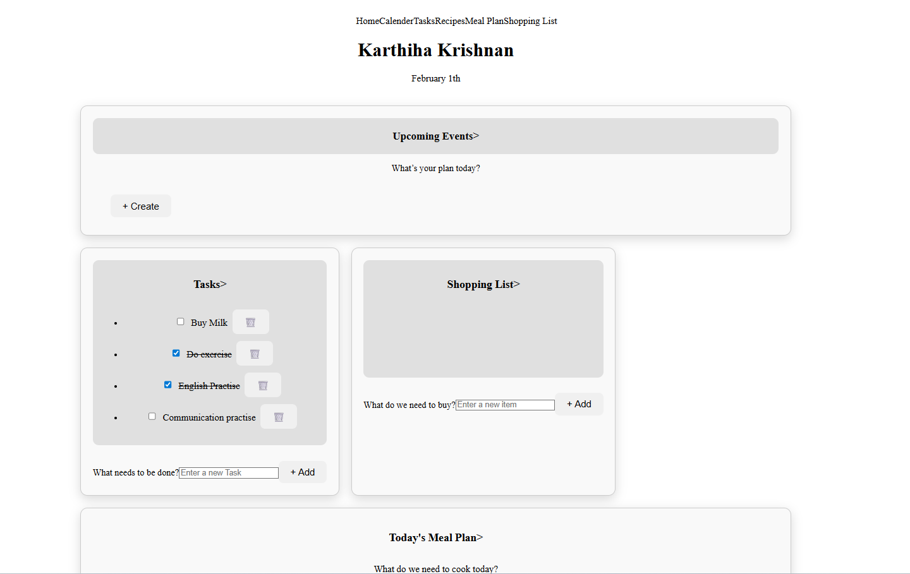

# 🏠 Smart Household Manager
A modular full-stack web application evolving from a grocery tracker into a centralized household management system.

Built with a separated frontend–backend architecture using React (Vite), Node.js, Express, and PostgreSQL, with secure JWT-based authentication.

**Author:** Karthiha Krishnan  
**Role:** Aspiring Full-Stack Developer  
📍 Queensland, Australia  



---

## 🚀 Live Demo
Frontend (In Progress):
🔗 (https://karthihakrishnan.github.io/Smart-household-manager/) 

Backend: Local development environment (deployment planned)

---

## 🏗 Architecture

This project follows a clean separated frontend-backend architecture:
```bash
smart-household-manager/
├── frontend/ → React (Vite) Frontend
├── backend/  → Express REST API + PostgreSQL
├── docs/     → Screenshots & diagrams
└── README.md
```

### Frontend (`/frontend`)
- React (Vite)
- Component-based UI
- Axios for API communication
- State managed via useState and useEffect
- Environment-based configuration

### Backend (`/backend`)
- Node.js + Express
- PostgreSQL database
- JWT authentication middleware
- User-scoped database queries
- Modular structure inside `src/`
This separation allows independent scaling, clean maintainability, and production-style structure.

---

## 🔄 Application Flow
```bash
User Action
   ↓
React UI (Axios request)
   ↓
Express Controller
   ↓
PostgreSQL Query
   ↓
JSON Response
   ↓
React State Update → UI Re-render
```

All frontend operations communicate exclusively through REST APIs.
PostgreSQL serves as the source of truth.

---

## 🔐 Authentication System (JWT-based)
### Implemented Features
- User registration with validation
- Password hashing using bcrypt
- Login endpoint with secure password comparison
- JWT token generation (expires in 1 hour)
- Authentication middleware
- Protected grocery routes
- User-scoped database queries

### Authentication Flow
1. User registers → password hashed and stored securely.
2. User logs in → JWT token generated.
3. Token sent via Authorization: Bearer <token>.
4. Middleware verifies token and attaches `req.user`.
5. Routes filter data by user_id.

---

## 🛒 Grocery Module (Full-Stack)
### Capabilities
- Add grocery items
- Fetch items from PostgreSQL
- Mark items as purchased
- Delete items
- Separate pending / purchased states
- Full CRUD operations
- Persistent across refreshes & server restarts
- Fully user-scoped

Earlier versions used LocalStorage.
The system is now fully API-driven.

---

## ✅ Tasks Module (Full-Stack)
### Capabilities
- Fetch tasks from database
- Add new tasks
- Toggle completion status
- Delete tasks
- Persistent PostgreSQL storage
- REST API communication (GET, POST, PATCH, DELETE)

The Tasks module represents a complete end-to-end feature built without tutorial guidance.

---

## 🧑‍💻 Technology Stack
### Frontend
- React (Vite)
- JavaScript (ES6+)
- HTML5 & CSS3
- Axios

### Backend
- Node.js
- Express
- PostgreSQL
- bcrypt
- JSON Web Tokens (JWT)

### Development Tools
- VS Code
- Postman
- Git & GitHub.

---

## 🔌 REST API Endpoints
### Authentication
| Method | Endpoint	| Description |
|--------|----------|------------|
| POST | /api/auth/register	| Register new user |
| POST | /api/auth/login |Login user |

### Grocery
| Method | Endpoint	| Description |
|--------|----------|------------|
| GET | /api/grocery_items | Fetch all items |
| POST | /api/grocery_items |	Add item |
| PATCH	| /api/grocery_items/:id | Update status |
| DELETE | /api/grocery_items/:id |	Delete item |

### Tasks
| Method | Endpoint	| Description |
|--------|----------|------------|
| GET |	/api/tasks | Fetch all tasks |
| POST | /api/tasks |	Create task |
| PATCH |	/api/tasks/:id | Toggle completion |
| DELETE | /api/tasks/:id	| Delete task |

---

## 🗄 Database Schema (PostgreSQL)
### users
- id (SERIAL PRIMARY KEY)
- email (TEXT UNIQUE NOT NULL)
- password (TEXT, hashed)
- created_at (TIMESTAMP DEFAULT CURRENT_TIMESTAMP)

### grocery_items
- id (SERIAL PRIMARY KEY)
- item_name (TEXT)
- status (TEXT: pending / purchased)
- user_id (INTEGER → users.id)
- created_at
- updated_at

### tasks
- id (SERIAL PRIMARY KEY)
- title (TEXT)
- completed (BOOLEAN)
- user_id (INTEGER → users.id)
- created_at
- updated_at

---

## ⚙️ Local Development Setup
### 1️⃣ Clone Repository
git clone https://github.com/yourusername/smart-household-manager.git
cd smart-household-manager

### 2️⃣ Backend Setup
cd server
npm install

### Create .env file:
```bash
DB_HOST=localhost
DB_PORT=5432
DB_NAME=smart_household
DB_USER=postgres
DB_PASSWORD=yourpassword
JWT_SECRET=your_secret_key
```

### Start server:
npm run dev

### 3️⃣ Frontend Setup
cd web
npm install

### Create .env:
VITE_API_URL=http://localhost:5000

### Start frontend:
npm run dev

---

## 🛠️ Roadmap
- Protect Tasks module with user-scoping
- Frontend login/register UI integration
- Household sharing model
- Barcode scanning support
- Shopping List module (React + PostgreSQL)
- Mobile responsiveness improvements
- Full dashboard integration
- Production deployment (Render / Railway / AWS)

---
## 🎯 Engineering Approach
This project demonstrates:
- Full request lifecycle understanding
- Authentication and authorization flow
- Clean REST API design
- Relational database modeling
- Incremental system evolution
- Separation of concerns
- Production-style architecture

Rather than building multiple small demos, this application evolves continuously to mirror real-world product development.

---

## 📌 Project Status
### 🟡 Actively In Progress
Core authentication, Grocery, and Tasks modules completed.


 

