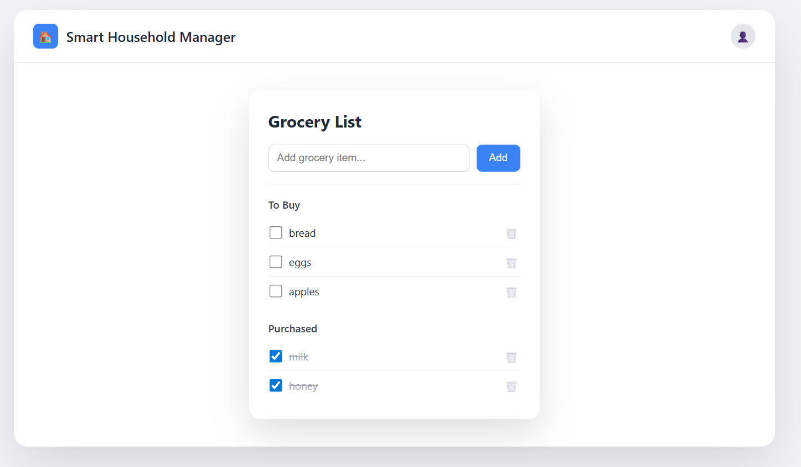

# 🏠 Smart Household Manager
A modular full-stack web application to manage groceries and household activities efficiently.

**Author:** Karthiha Krishnan  
**Role:** Aspiring Full-Stack Developer  
📍 Queensland, Australia  



---

## 🚀 Live Demo
🔗 https://karthihakrishnan.github.io/Smart-Grocery-Tracker/

---

## 📌 Project Overview
Smart Household Manager is a real-world, evolving full-stack project.

It begins as a **Smart Grocery Tracker** and will gradually expand into a complete household management system, including bills, chores, maintenance, and inventory tracking.

---

## 💡 Why I Built This Project
I started this project to strengthen my frontend fundamentals using **HTML, CSS, and JavaScript**.

While building and using the app, I realised that real grocery applications require:
- Persistent data across devices
- Clear separation of item states
- A reliable backend source of truth
- Support for real-world workflows (e.g., barcode scanning)

Instead of stopping at a basic demo, I chose to evolve this single project into my full-stack learning journey.

---

## 🛒 Current Features (Grocery Tracker)
- Add and remove grocery items
- Separate **pending** and **purchased** items
- Mark items as purchased
- Clean, minimal UI
- Persistent storage using browser **LocalStorage**

---

## 🧭 How This Project Evolved
**Phase 1 — Frontend Foundation**
- Built the interface using HTML and CSS
- Implemented interactive behaviour using JavaScript
- Practised DOM manipulation and event handling
- Managed UI state changes between pending and purchased items
- Improved layout and usability through iteration

**Phase 2 — Data Persistence**
- Introduced a data-driven render architecture
- Implemented persistence using LocalStorage
- Ensured items survive page refresh and browser restart
- Designed with a “single source of truth” to support future backend migration

**Phase 3 — UI Polish & Usability**
- Improved readability (spacing + typography)
- Added a centered card layout for focus
- Enhanced visual distinction between pending and purchased items
- Prioritised clarity over decoration

---

## 🎨 User Interface (v1.4)
The UI is clean, readable, and distraction-free.

A centered card layout keeps focus on the task, with clear visual separation between pending and purchased items. Spacing and contrast are intentionally minimal to improve scanning and usability.

---

## ⚠️ Current Limitations
At the moment:
- Data is stored only in the browser (LocalStorage)
- The list does not sync across devices
- Clearing browser data removes the saved list

These limitations are intentional and help demonstrate why backend systems are required in real applications.

---

## 🛠️ Roadmap
- Backend API integration
- PostgreSQL database
- Barcode scanning support
- Shopping history & re-add items
- Improved mobile & accessibility support

---

## 📚 What I’m Learning From This Project
- Frontend fundamentals (HTML, CSS, JavaScript)
- UI state management and rendering logic
- Why and when backend systems are needed
- API-based communication (frontend ↔ backend)
- Real-world data persistence
- Product-oriented thinking

---

## 🎯 Why I Chose This Approach
Instead of building many small demo projects, I chose to:
- Build one meaningful application
- Improve it step by step
- Learn each layer only when it becomes necessary

This mirrors how real software products evolve in professional environments.

---

## 🌱 Future Vision
The long-term goal is to turn this into a personal shopping assistant that:
- Works across devices
- Reduces manual tracking
- Supports barcode scanning for faster shopping
- Demonstrates a complete full-stack workflow

---

## 🧑‍💻 Technologies Used
**Current**
- HTML
- CSS
- JavaScript
- Browser LocalStorage

**Planned**
- Node.js + Express 
- PostgreSQL 
- REST APIs

## 🧩 Planned Backend Design
To support data persistence, multi-device access, and future scalability, this project is designed with a backend-first data model.

### Database Schema (Planned – PostgreSQL)
**users**
- id (UUID, primary key)
- name
- email (unique)
- created_at
- updated_at

**grocery_items**
- id (UUID, primary key)
- user_id (foriegn key -> users.id)
- item_name
- status (pending/purchased)
- created_at
- updated_at

### Design consideration
- Each grocery item belongs to a specific user
- Item state is explicitly stored using a status field
- UUIDs are used for safer frontend-backend communication
- Timestamps support auditing, sorting, and sync logic
- Schema is designed to support future features such as authontication, multi-device sync, and shared lists.

---

## 🧭 Project Structure
```txt
smart-household-manager/
├── client/    # Frontend
├── server/    # Backend (planned)
├── docs/      # Screenshots & diagrams
└── README.md


